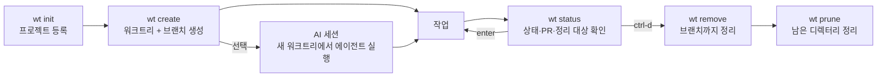

# workytree

[](https://github.com/Ahngbeom/workytree/actions/workflows/ci.yml)

Git worktree를 프로젝트 단위로 만들고, 상태를 한눈에 보고, 작업을 잃지 않게 지우는 zsh 도구다.
명령은 `workytree`이고, 대화형 셸에서는 짧은 별칭 `wt`를 쓴다.



## 기능

| 기능 | 명령 | 하는 일 |
|---|---|---|
| 워크트리 만들기 | `wt create` | repo → kind → ticket → base를 묻고 `<kind>/<ticket>` 브랜치와 워크트리를 만든 뒤 그 디렉터리로 이동 |
| 상태 보기 | `wt status` | 모든 워크트리·브랜치의 최근 활동, PR/MR, 지워도 되는지 여부를 fzf 목록으로 표시 |
| 워크트리 지우기 | `wt remove` | 변경 사항·로컬 브랜치·원격 브랜치를 하나씩 확인하고 지운 뒤 원하는 곳으로 이동 |
| 정리 | `wt prune` | git이 잊은 워크트리 기록과 내용 없는 고아 디렉터리 정리 |
| AI 세션 | `wt create --ai` | 새 워크트리에서 Claude Code 같은 코딩 에이전트를 바로 실행 (기본 꺼짐) |
| 이동·조회 | `wt cd`, `wt path`, `wt list`, `wt repos` | 워크트리로 이동하거나 경로·목록 출력 |
| 설정 관리 | `wt project`, `wt repo`, `wt config` | 프로젝트·repo 등록, 설정 읽기·쓰기 |

모든 대화형 질문은 방향키와 Enter로 답한다. 자세한 조작은 [대화형 프롬프트](#대화형-프롬프트)에 있다.

## 빠른 시작

1. 설치한다.
   ```sh
   curl -fsSL https://raw.githubusercontent.com/Ahngbeom/workytree/main/install.sh | sh
   exec zsh
   ```
2. 프로젝트를 등록한다. clone이 모여 있는 디렉터리(`repo_root`)와 워크트리를 둘 디렉터리(`worktree_root`)를 묻는다.
   ```sh
   workytree init
   ```
3. 워크트리를 만든다.
   ```sh
   wt create
   ```

## 설치

저장소를 직접 clone한 뒤 설치 스크립트를 실행해도 된다.

```sh
git clone https://github.com/Ahngbeom/workytree.git workytree
cd workytree
sh install.sh
exec zsh
workytree init
```

| 항목 | 동작 |
|---|---|
| 설치 원본 | checkout 안에서 실행하면(`bin/workytree`, `lib/`, `shell/`이 옆에 있으면) 네트워크 없이 그 checkout을 그대로 씀 |
| 실행 파일 | `~/.local/bin/workytree`를 checkout으로 심볼릭 링크 |
| `~/.zshrc` | `source` 한 줄 추가. 먼저 `.zshrc.bak-<timestamp>`로 백업하고, 같은 줄을 두 번 넣지 않음 |
| 재실행 | 안전함. `curl` 설치본은 기본 위치(`~/.local/share/workytree`)에서 `git pull --ff-only`로 갱신 |
| 검증 환경 | zsh 5.9, git 2.50.1. `curl` 설치 경로는 CI의 `install-smoke` 작업이 커밋마다 검증 |

`fzf`가 `PATH`에 있으면 선택 화면에 fzf를 쓰고, 없으면 내장 메뉴를 쓴다. `wt status`의 목록 화면은 fzf 0.38 이상이 필요하다.

`wt` 별칭이 필요 없으면 설정에 `alias_wt = false`를 쓰거나, 현재 셸에서만 `WORKYTREE_ALIAS=0`을 설정한다.

## 개념

**프로젝트**는 `repo_root`와 `worktree_root`의 짝이다. `repo_root` 아래를 `scan_depth`(기본 3) 단계까지 훑어 repo를 찾는다. 워크트리는 `<worktree_root>/<repo>/<kind>/<ticket>`에 `<kind>/<ticket>` 브랜치로 만든다.

```ini
# ~/.config/workytree/config
default_project = work
alias_wt = true
kinds = feature,fix,chore,hotfix,refactor

[project work]
repo_root     = ~/work/products
worktree_root = ~/work/worktrees
scan_depth    = 3

[repo legacy]            # 선택: repo_root 밖의 clone을 직접 등록
path    = ~/elsewhere/legacy-api
project = work
```

> **주의**: `scan_depth`보다 깊은 repo는 아무 경고 없이 빠진다. 기본값 3이면 `repo_root/a/b/c`의 repo는 찾지만 `repo_root/a/b/c/d`는 찾지 못한다. 더 깊게 두었다면 그 프로젝트의 `scan_depth`를 올리거나 `workytree repo add`로 직접 등록한다.

repo 이름은 다음 순서로 찾는다.

1. 등록된 `[repo]` 별칭
2. 모든 프로젝트의 `repo_root` 스캔
3. 현재 디렉터리

여러 프로젝트에 같은 이름이 있으면 `--project <name>`으로 고른다. **같은 프로젝트 안**에서 이름이 겹치면 `--project`로는 가릴 수 없으므로 `workytree repo add <path> --name <alias>`로 다른 별칭을 붙인다.

## 사용법

```sh
wt create                          # 대화형: project → repo → kind → ticket → base → 확인
wt create fix PROJ-1               # repo 안에서: repo 확인 후 생성
wt create server fix PROJ-1        # repo 지정
wt create server fix PROJ-1 origin/develop -y
wt create --ai fix PROJ-1          # 생성하고 이동한 뒤 AI 세션 실행
wt cd server fix PROJ-1
wt list [repo] · wt repos · wt path [repo [kind [ticket]]]
wt status [repo] [--fetch|--offline] [--stale [days]] [--json] [--plain]
wt remove                          # 대화형: 워크트리 선택 → 브랜치 → 이동할 곳 → 확인
wt remove server fix PROJ-1        # 대화형: 브랜치 → 이동할 곳 → 확인
wt remove server fix PROJ-1 [--force] [-b|-B] [-r] [--to <dir>] -y
wt prune [repo]
wt project add <name> <repo_root> <worktree_root>
wt repo add <path> [--name n] [--project p]
wt config get|set|edit|path
```

`--project`, `--yes`/`-y`, `--no-color`는 전역 옵션이라 명령줄 어디에 써도 된다.

## 워크트리 만들기


`create`는 빠진 인자만 묻는다. repo 안에서 실행하면 그 repo를 쓸지 먼저 확인하고, kind·ticket·base를 차례로 받은 뒤 요약을 보여 주고 `Create?`로 확인한다. 셸 통합으로 실행했다면 만든 워크트리로 바로 이동한다.

- 브랜치를 만들기 전에 `origin`을 fetch하므로 자동으로 고른 base(`origin/main` 등)가 항상 최신
- `origin`이 없으면 fetch를 건너뛰고, fetch가 실패하면 경고 후 로컬 ref로 계속 진행
- 같은 워크트리가 이미 있으면 새로 만들지 않고 재사용

## 상태 보기


`wt status`는 범위 안의 repo(`--project` 또는 `[repo]` 하나)에서 다음을 모두 보여 준다.

- 모든 워크트리
- 워크트리가 없는 로컬 브랜치
- `worktree_root` 아래에 있지만 git이 모르는 디렉터리

fzf 0.38 이상이 있고 양쪽이 터미널이면 상세 창이 있는 fzf 목록을 연다. `--plain`, fzf 없음·구버전, 출력 파이프 중 하나라도 해당하면 표로 출력하고, `--json`은 같은 데이터를 스크립트용으로 출력한다. 보기만 할 뿐 정리·fetch(`--fetch` 제외)·삭제는 하지 않는다.

| 표시 | 뜻 |
|---|---|
| `✓` | 지워도 안전함: base 브랜치에 병합, PR/MR 병합·종료(브랜치가 PR 마지막 커밋을 가리킬 때), upstream 삭제 중 하나이면서 커밋 안 된 변경·push 안 된 커밋·잠금이 모두 없음 |
| `●` | 오래됨: `stale_days`(기본 30일)보다 오래 손대지 않았지만 안전하다고 증명되지는 않음 |
| `!` | 지우면 작업을 잃음: 커밋 안 된 변경(또는 확인 불가), upstream에 없는 커밋, upstream이 없으면 base에 없는 커밋 |

| 키 | 동작 |
|---|---|
| `enter` | 워크트리로 이동 (셸 통합 전용, `bin/workytree`는 경로만 출력) |
| `ctrl-d` | 평소 질문과 함께 `wt remove` 실행 후 새로고침 |
| `ctrl-o` | 브라우저에서 PR/MR 열기 |
| `ctrl-r` | 모든 repo `git fetch` 후 새로고침 |
| `ctrl-s` | `stale`/`safe` 행만 보기 (다시 누르면 전체) |
| `ctrl-/` | 상세 창을 오른쪽 ↔ 아래로 전환 |

- `ACTIVE`: 워크트리의 마지막 활동(index/HEAD), `COMMIT`: 브랜치의 마지막 커밋, 생성 시각: 상세 창
- base 브랜치는 `origin/HEAD`, 없으면 `origin/main`이나 `origin/master`, 그것도 없으면 메인 checkout의 브랜치
- 자기 커밋이 없는 브랜치는 "병합됨" 처리. 방금 만들고 커밋하지 않은 워크트리도 `✓`
- 상세 창은 터미널이 100열 이상이면 오른쪽, 아니면 아래에 표시되고 창 크기 변경에 맞춰 이동

PR/MR 정보는 repo마다 한 번씩 `gh`(GitHub)나 `glab`(GitLab, `glab`이 로그인한 self-hosted 포함)을 호출해 가져온다. 둘 다 없거나 `--offline`이면 PR 열만 비고 나머지는 그대로 동작한다. squash·rebase 병합은 git이 추적할 조상 관계를 남기지 않으므로, 그런 브랜치는 PR/MR을 조회할 수 있을 때만 병합됨으로 표시된다.

```sh
wt config set stale_days 14                  # 모든 프로젝트
wt config set project.work.stale_days 60     # 한 프로젝트
```

스크립트에서는 `bin/workytree status --json`을 직접 호출한다. `wt` 함수를 거치면 이동할 경로를 찾으려고 출력을 먼저 가로채기 때문이다.

## 워크트리 지우기


터미널에서 실행하면 `remove`는 워크트리 밖의 것을 건드리기 전에 하나씩 묻는다.

1. 어떤 워크트리를 지울지 (`repo`·`kind`·`ticket`이 빠졌을 때). 주어진 인자로 목록을 좁히고 지금 있는 워크트리를 먼저 제안
2. 커밋 안 된 변경을 버릴지 (변경이 있을 때만. 거절하면 멈추고 `git stash -u`나 `--force`를 안내한다)
3. 로컬 브랜치를 지울지. 병합된 브랜치는 기본값 예, 병합 안 된 브랜치는 강제 삭제를 한 번 더 확인
4. 원격 브랜치를 지울지 (upstream이나 같은 이름의 `refs/remotes/<remote>/` ref가 있을 때). `git fetch --prune origin` 직후 확인. 원격에 삭제를 push하므로 기본값 아니오
5. 지운 뒤 어디로 이동할지 (셸 통합으로 실행했을 때만)
6. 계획 요약과 `Proceed?`

단계마다 진행 표시줄이 나오고, 실패하면 `hint:` 줄로 해결 방법을 알려 주며, 마지막 요약에 지운 것·남긴 것·실패한 것을 정리한다.

- `-y`를 주거나 터미널이 없으면 묻지 않고 옵션대로 처리한다: `-b`/`-B` 로컬 브랜치, `-r` 원격 브랜치, `--to <dir>` 이동할 곳
- 지금 있는 워크트리를 지우면 `--to`가 없는 한 원본 repo로 이동
- 브랜치 삭제가 실패해도 종료 코드는 유지. 그 시점에 워크트리는 이미 지워진 상태

> **주의**: gitignore된 파일(`.env`, `node_modules` 등)은 변경으로 치지 않으므로 경고 없이 함께 지워진다. [알려진 제약](#알려진-제약)을 참고한다.

## 정리

`wt prune [repo]`는 `git worktree prune`으로 사라진 워크트리 기록을 지우고, `worktree_root` 아래에서 git에 등록되지 않은 `<kind>/<ticket>` 디렉터리를 찾는다. 그 디렉터리에 버려도 되는 파일만 있으면 지우고, 그 밖의 경우(판단할 수 없을 때 포함)에는 남기고 경고한다.

## AI 세션


`create`는 새 워크트리를 AI 코딩 에이전트에 바로 넘길 수 있다. **기본값은 꺼짐**이다. 켜기 전에는 에이전트를 제안하거나 묻거나 실행하지 않고, 실행에 쓰는 임시 파일도 만들지 않는다.

```sh
wt create --ai fix PROJ-1        # 이번 한 번만
wt config set ai_session always  # 매번
```

에이전트는 현재 셸에서, 새 워크트리 안에서, 포그라운드로 실행된다. 에이전트를 끝내면 그 워크트리에 그대로 남는다. 셸 통합(`wt`, 또는 이 저장소가 설치하는 `workytree` 함수)으로 실행할 때만 동작한다. `bin/workytree`를 직접 부르면 워크트리는 만들지만 에이전트는 실행하지 않고, AI 세션이 켜져 있으면 그 이유를 경고로 알려 준다.

| 키 | 범위 | 뜻 |
|---|---|---|
| `ai_session` | 전역, `[project]` | `off`(기본), `ask`(먼저 확인), `always` |
| `ai_agent` | 전역, `[project]` | 실행할 에이전트. 비우면 자동 감지 |

자동 감지는 `PATH`에서 `claude`, `codex`, `gemini`, `cursor-agent`, `aider` 순서로 처음 찾은 것을 쓴다. `--ai`는 그 실행에 한해 `ai_session`을 덮어쓰고 `ask` 확인도 건너뛴다.

실행 전에 에이전트의 주요 옵션을 메뉴로 묻는다. `kinds`처럼 목록에서 고르거나 목록에 없는 값을 직접 입력할 수 있다. 무엇을 물을지는 `[agent <name>]` 섹션이 정한다.

```ini
[agent claude]
command         = claude
ask             = permission_mode,model,teammate_mode
permission_mode = plan,acceptEdits,auto,bypassPermissions,dontAsk,manual
model           = opus,sonnet,fable
effort          = low,medium,high,xhigh,max
teammate_mode   = auto,tmux,iterm2,in-process
```

- `ask`: 물을 옵션과 순서. 위 예시의 `effort`는 `ask`에 넣기 전까지 묻지 않음
- 키 이름 변환: `permission_mode` → `--permission-mode <value>`
- `(skip)`을 고르면 그 플래그 없이 실행
- 위 블록이 `claude`의 내장 프로필. 직접 쓴 `[agent claude]`는 합쳐지지 않고 **통째로 대체**하므로 목록을 줄일 수도 있음
- 프로필이 없는 에이전트(`ai_agent = aider` 등)는 옵션 메뉴 없음. `ask`면 "open a $name session here?"만 묻고, `always`나 `--ai`면 바로 실행
- `-y`/`--yes`: 질문 없이 `command`만 실행
- 질문을 취소(`q`)해도 워크트리는 남고 종료 코드 0. 세션을 열지 않은 것은 `create` 실패로 치지 않음

## 대화형 프롬프트

`create`, `remove`, `init`, AI 세션의 질문은 모두 방향키와 Enter로 답한다.

| 화면 | 이동 | 결정 | 바로 답하기 | 취소 |
|---|---|---|---|---|
| 예/아니오 확인 | ←/→ (↑/↓, Tab, h/j/k/l) | Enter. 기본값이 미리 선택됨 | `y` / `n` | `q`, Esc, Ctrl-C |
| 목록 선택 (fzf 없음) | ↑/↓ 또는 j/k, 끝에서 반대쪽으로 넘어감 | Enter | 숫자 1–9 | `q`, Esc, Ctrl-C |
| 목록 선택 (fzf 있음) | fzf 조작 그대로 | Enter | 검색어 입력 | Esc |

- 직접 값을 입력할 수 있는 목록(`kind`, 에이전트 옵션)은 마지막 줄 `(type a value…)`를 고르면 한 줄 입력으로 전환
- 취소하면 종료 코드 130

## 설정

설정 파일은 `~/.config/workytree/config`이다. `wt config path`로 위치를, `wt config edit`로 편집기를 연다.

| 키 | 위치 | 기본값 | 설명 |
|---|---|---|---|
| `default_project` | 전역 | 없음 | 프로젝트를 고르지 않았을 때 쓸 프로젝트 |
| `alias_wt` | 전역 | `true` | `wt` 별칭 설치 |
| `kinds` | 전역 | `feature,fix,chore,hotfix,refactor` | `create`의 kind 목록 |
| `stale_days` | 전역, `[project]` | `30` | `status`의 `●` 기준 일수 |
| `ai_session` | 전역, `[project]` | `off` | [AI 세션](#ai-세션) 참고 |
| `ai_agent` | 전역, `[project]` | 자동 감지 | [AI 세션](#ai-세션) 참고 |
| `repo_root` | `[project]` | 필수 | repo를 찾을 디렉터리 |
| `worktree_root` | `[project]` | 필수 | 워크트리를 만들 디렉터리 |
| `scan_depth` | `[project]` | `3` | `repo_root` 스캔 깊이 |
| `path`, `project` | `[repo]` | 필수 | 직접 등록한 repo의 경로와 프로젝트 |

```sh
wt config set stale_days 14
wt config set project.work.worktree_root ~/work/worktrees
```

## 종료 코드

| 코드 | 뜻 |
|---|---|
| 0 | 성공 |
| 1 | 일반 오류: 잘못된 인자 값(모르는 repo·프로젝트, `-B` 없이 병합 안 된 브랜치 등), 또는 유효한 설정이 이미 있어 `init`이 거부함 |
| 2 | 사용법 오류: 인자 개수가 틀림, 모르는 플래그 |
| 3 | 설정 **파일 상태** 문제: 설정 파일 없음, 파싱 실패(중복 섹션·키, 읽을 수 없는 줄), 읽을 수 없거나 일반 파일이 아님, `[project]`에 `repo_root`·`worktree_root` 누락, `repo_root`·`worktree_root`가 상대 경로·`/`·`$HOME`의 상위 디렉터리, 설정 디렉터리에 쓸 수 없음 |
| 130 | 대화형 질문 취소 (`q`, Esc, Ctrl-C, EOF) |

`resolve_repo`의 "unsafe repo name" 거부와 `prune`의 여러 repo 일괄 실패는 3이 더 어울리지만 1로 끝난다. 알고 있는 어긋남이며 이번에는 고치지 않는다.

## 알려진 제약

개발 중에 발견했고 의도적으로 그대로 둔 동작이다. 버그보다 이쪽을 먼저 만나게 될 것이다.

| 제약 | 대응 |
|---|---|
| `remove`가 gitignore된 파일을 경고 없이 지움 | 지우기 전에 `.env` 같은 파일을 따로 백업 |
| bare repo(`project.git`)를 찾지 못함 | `workytree repo add <bare.git 경로>`로 등록 |
| 심볼릭 링크로만 닿는 repo, `repo_root` 바로 그 위치의 repo를 찾지 못함 | `workytree repo add`로 등록 |
| `create`의 첫 위치 인자가 알려진 repo 이름이면 repo로 해석됨 | 인자 네 개를 모두 쓰거나 repo 안에서·대화형으로 실행 |
| `[project]` 하나가 불완전하면 설정 전체를 거부함 | `config path/get/set/edit`는 동작하므로 `config set project.<name>.worktree_root <path>`로 복구 |
| 내용이 똑같은 `wt` 함수를 직접 쓰면 workytree 것으로 보고 셸 설정을 다시 읽을 때마다 덮어씀 | 직접 관리하려면 `alias_wt = false` |
| 섹션을 지우면 그 위의 주석 줄이 남음 | 남은 주석을 직접 정리 |
| `repo add`는 git 작업 디렉터리면 무엇이든 받음 | 워크트리가 아닌 원본 clone 경로를 지정, 심볼릭 링크면 `--name` 지정 |
| `teammate_mode`는 문서화되지 않은 `claude` 플래그에 기댐 | 깨지면 자기 `[agent claude]`의 `ask`에서 `teammate_mode`를 뺌 |
| `[agent]`의 `command`는 셸 명령줄처럼 토큰으로 나뉨 | 아래 상세 참고 |
| AI 세션을 켜는 설정은 다음 셸부터 적용됨 | 새 셸을 열거나 `--ai` 사용 |
| AI 세션이 켜져 있으면 `post-checkout` hook이 실행 내용을 바꿀 수 있음 | 아래 상세 참고 |

<details>
<summary><code>remove</code>와 gitignore된 파일</summary>

`remove`는 `git status`로 워크트리가 깨끗한지 판단한다. gitignore된 파일은 정의상 `git status`에 보이지 않으므로, 그런 파일만 있는 워크트리는 깨끗하다고 판단해 그대로 지운다. 종료 코드는 0이고 `--force`도 필요 없으며, `Proceed?` 요약에도 파일은 나오지 않는다. `git worktree remove`와 같은 동작이라 workytree가 고치지는 않지만, 다른 곳에 없는 `.env`는 `remove`를 실행하는 순간 사라진다.

</details>

<details>
<summary><code>[agent]</code> <code>command</code>의 토큰 처리</summary>

`command`는 argv 한 원소당 한 줄로 셸 래퍼에 전달되고 `${(f)}`로 다시 읽힌다. 덕분에 설정 문자열에 `eval`을 쓰지 않지만, 그 전에 `${(z)}`/`${(Q)}`를 거치므로 셸 따옴표 규칙이 그대로 적용된다.

| 쓴 값 | 에이전트가 받는 값 |
|---|---|
| `claude --sys "be brief"`, `hello\ there` | 따옴표·백슬래시가 빠진 인자 하나 |
| `claude --bare C:\path` (따옴표 없음) | `C:path` (백슬래시가 이스케이프로 사라짐) |
| `claude --bare 'C:\path\to'`, `"C:\path\to"` | `C:\path\to` 그대로 |
| `claude --bare $'a\nb' --after` | 인자 네 개 `--bare`, `a`, `b`, `--after` (줄바꿈이 원소 구분자가 됨) |

빈 문자열 인자(`--flag ""`)는 `[agent]` 프로필로 표현할 수 없다.

</details>

<details>
<summary>AI 세션 설정이 다음 셸부터 적용되는 이유</summary>

AI 세션을 켰는지는 셸 설정이 래퍼를 source할 때 한 번 확인한다. 이 확인에는 CLI 호출이 들어가고 `create` 전에 답이 필요하므로, 이미 실행 중인 셸은 시작할 때의 답을 유지한다. `workytree config set ai_session ask|always`는 실행할 때 이 사실을 알려 준다. `--ai`는 어느 셸에서든 바로 동작하고, **끄는** 설정은 CLI가 매번 `ai_session`을 다시 읽으므로 바로 적용된다. `alias_wt`와 같은 절충이다.

</details>

<details>
<summary>AI 세션과 <code>post-checkout</code> hook</summary>

래퍼는 `$TMPDIR` 아래에 `workytree-ai.XXXXXX` 임시 파일을 만들고, `cd` 뒤에 그 파일의 내용을 실행한다. 이 파일은 AI 세션을 켠 실행(`--ai`, 또는 설정 어딘가의 `ai_session = ask|always`)에서만 만든다. 기능을 켰다면 `git worktree add` 중에 도는 hook이 glob으로 이 파일을 찾아 자기 명령을 넣을 수 있다.

새로운 코드 실행 경로는 아니다. `post-checkout` hook은 기능과 상관없이 매 `create`마다 사용자 권한으로 임의 코드를 실행한다. 달라지는 것은 실행 맥락으로, 가로채는 하위 프로세스에서 곧 입력할 포그라운드 셸로 바뀐다. 경로나 파일 디스크립터를 숨겨도 막을 수 없다. Linux에서는 같은 사용자 프로세스가 `/proc/<pid>/environ`과 `/proc/<pid>/fd`로 다른 프로세스의 환경과 열린 파일에 접근할 수 있기 때문이다. 그래서 켠 실행에서만 이 경로가 생긴다는 점이 workytree가 실제로 보장할 수 있는 성질이다.

</details>

## 개발

```sh
zsh tests/run.zsh                 # 전체 테스트
zsh docs/demo/render.zsh          # README GIF 다시 녹화 (vhs, ffmpeg 필요)
zsh docs/demo/render.zsh status   # 하나만
```

GIF는 `docs/demo/setup.zsh`가 만드는 임시 샌드박스(`$TMPDIR/workytree-demo`)에서 녹화하므로 실제 설정과 repo는 건드리지 않는다. 장면은 `docs/demo/*.tape`에서 고친다.
